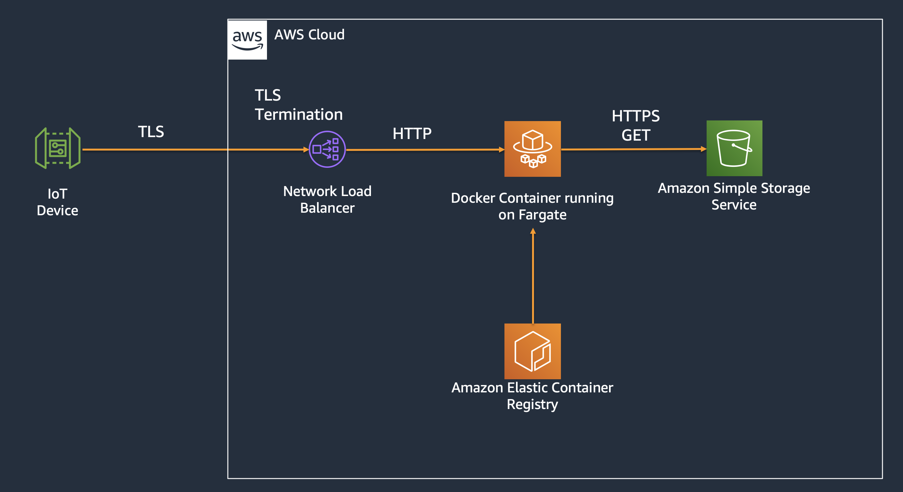

# S3 Drip Feed Proxy

## Objective

To proxy Amazon S3 buckets so that the response can be chunked; this is useful for clients that have low memory/CPU. This helps to get around S3 not supporting the [RFC6066 TLS extensions, specifically TLS frame length negotiation](https://tools.ietf.org/html/rfc6066#section-4).

## Pre-Requisites

- [Docker](https://www.docker.com/)

- [.NET Core 3.1](https://dotnet.microsoft.com/download/dotnet-core)

- An IDE - [VS Code](https://code.visualstudio.com/) will do fine

That's pretty much it. Since the application does not actually use AWS credentials but merely passes through any querystring parameters, this will work with presigned URLs.

## Configuration

- AWS_REGION - the AWS region that the S3 bucket is in, e.g. ap-southeast-1

- AWS_DEFAULT_REGION - the AWS region that the S3 bucket is in, e.g. ap-southeast-1

- S3_BUCKET - the name of the S3 bucket to proxy

- CHUNK_SIZE - the size of TLS frames, in bytes, to send back to the client. This is set to 4KB (4096) by default. Increase or reduce this as required to match the client's hardware specifications.

- TLS_WAIT_TIME - the time to wait between sending of each TLS frame, in milliseconds. By default, the proxy will wait 500ms between each TLS frame to prevent overwhelming downstream clients. This can be adjusted to match the capabilities of the client hardware.

### To run locally

- Create a .env file to pass environment variables to the Docker container.

- The S3 bucket that you want to proxy should be defined in S3_BUCKET.

- run.sh builds the Docker image and runs it. You might need to chmod +x it.

- To run this on TLS, you will need to use the self-signed (or trusted) certificate.

### To run this on AWS using Fargate

- Create your Fargate cluster

- Create your ECR repository; follow the push commands to tag and push the image 

- Create a task definition pointing to your ECR repository

- Set the following environment variables in the task definition: AWS_REGION, AWS_DEFAULT_REGION, S3_BUCKET, CHUNK_SIZE. 

- A comprehensive set of instructions is available [here](https://github.com/aws-samples/amazon-ecs-fargate-aspnetcore)

## Usage

This proxy will use a HTTP request to stream the file from Amazon S3 in sizes that the client can accept. To download a file called "myfile.doc" from an S3 bucket called "mybucket" in the ap-southeast-1 region, use the following URL:

https://ipaddress/file/myfile.doc

where ipaddress is either localhost or the DNS/IP address of the Network Load Balancer. The bucket name and region should be populated in the .env file (if running locally), or specified in the task definition if running on ECS.